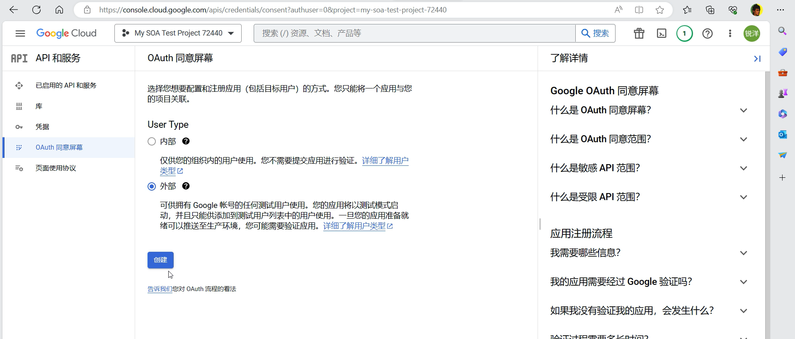

# Mr. Write - 基于参考文献的中文综述交互式生成

Mr. Write 是一个基于 ChatGPT 大模型构建的根据参考文献的中文综述交互式生成系统。 本系统将写作过程分为 Plan、Write、Rewrite 三个部分，并增加了以下功能：

- 检索：利用用户提供的文献 (如 PDF 格式)，使用 Contriever 进行筛选，使模型获取参考依据。
- 对话协作：利用 ChatGPT 的对话能力与用户进行实时协作，并通过对话理解用户的修改意图，从而根据用户的意图与意见进行文章修改。

通过这些功能，Mr. Write 可以根据参考文献快速生成高质量的中文综述，并与用户进行实时交互，优化文章内容。欢迎尝试并提出宝贵建议！

## 写作助手配置教程

可以参考[配置教学视频](./pic/intro.mp4)

也可以参考以下流程进行配置：

* 创建一个新的`google doc`文件，并依序点击【扩展程序】、【Apps脚本】进入到脚本编辑器

* 将提供的三个代码文件复制到脚本编辑器，并且注意两个`html`文件的名称必须严格保持一致

* 接着进行`Google Cloud Platform`配置，使用相同的`google`账号，登入`Google Cloud Console`（https://console.cloud.google.com/），依次点击【选择项目】、【新建项目】

* 选择刚才创建完成的专案，点击设置，将项目编号复制

* 回到刚才创建的`google doc`文档的脚本编辑器，点击左边栏的设置，然后在`Google Cloud Platform(GCP)`项目配置栏位点击更改项目，将刚才复制好的项目编号贴上，点击【设置项目】，此时会出现如下提示，根据提示点击【OAuth 同意屏幕详细信息】，

* 跳转到此页面，并点击【配置同意屏幕】

* 选择外部，并点击创建

* 第一阶段在必填栏位填写应用名称、电子邮件以及开发者联系信息，填写完毕点击【保存并继续】

* 第二阶段不用做任何的更改，直接点击【保存并继续】，进入第三阶段测试用户配置，点击`+ ADD USERS`，将邮箱填入，点击【保存并继续】就完成了项目配置

* 回到刚才创建的`google doc`文档的脚本编辑区的设置，重新点击【设置项目】，此时不会再出现错误提示，代表配置成功

* 此时点击左侧菜单栏的触发条件，进行触发器的配置，第一个栏位选择update函数，配置如下，并点击保存

* 回到`google doc`文档刷新页面，就能使用`Assistant`插件

