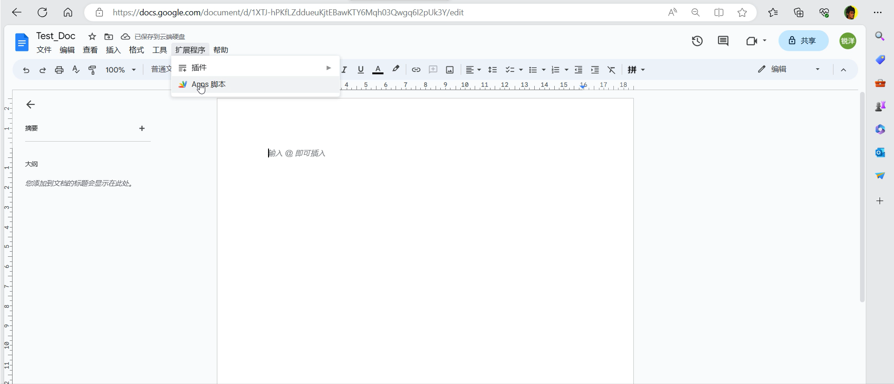
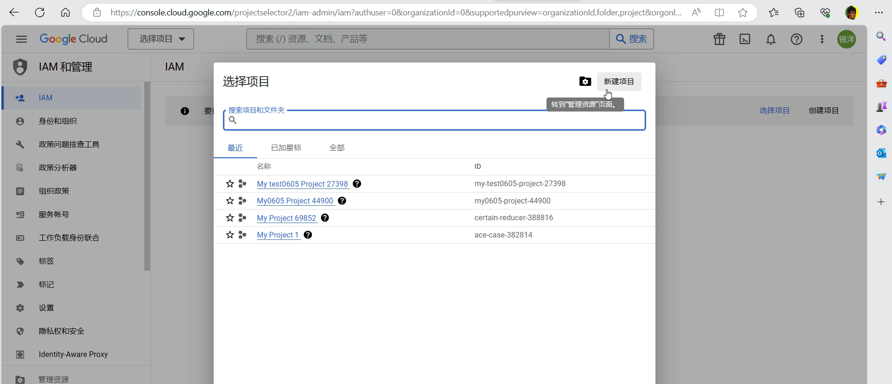
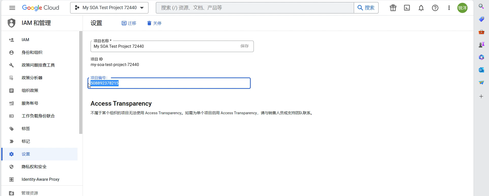
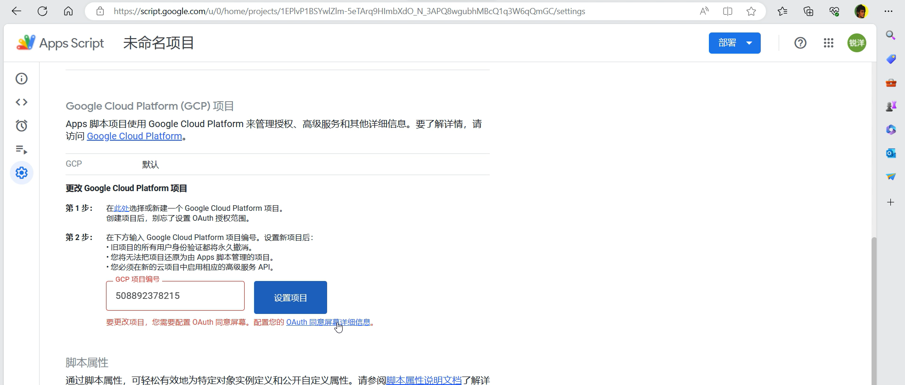
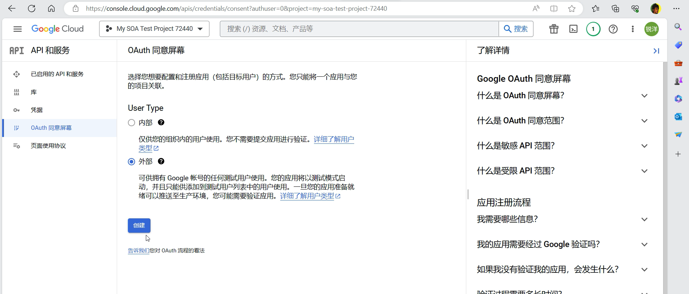
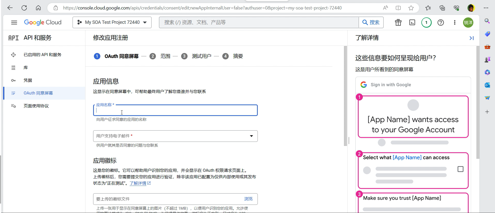
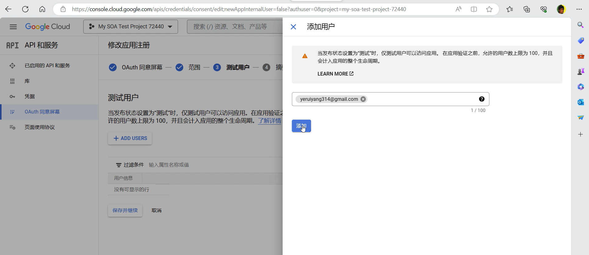
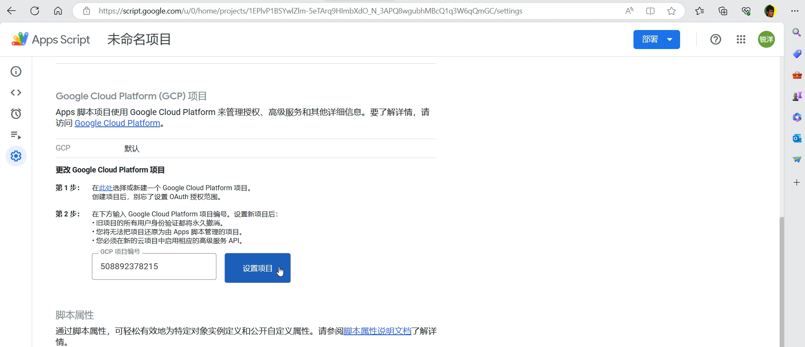
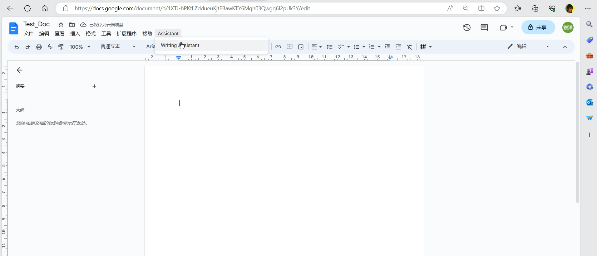

# 脚本配置流程

* 创建一个新的`google doc`文件，并依序点击【扩展程序】、【Apps脚本】进入到脚本编辑器

* 将提供的三个代码文件复制到脚本编辑器，并且注意两个`html`文件的名称必须严格保持一致

* 接着进行`Google Cloud Platform`配置，使用相同的`google`账号，登入`Google Cloud Console`（https://console.cloud.google.com/），依次点击【选择项目】、【新建项目】

* 选择刚才创建完成的专案，点击设置，将项目编号复制

* 回到刚才创建的`google doc`文档的脚本编辑器，点击左边栏的设置，然后在`Google Cloud Platform(GCP)`项目配置栏位点击更改项目，将刚才复制好的项目编号贴上，点击【设置项目】，此时会出现如下提示，根据提示点击【OAuth 同意屏幕详细信息】，

* 跳转到此页面，并点击【配置同意屏幕】

* 选择外部，并点击创建

* 第一阶段在必填栏位填写应用名称、电子邮件以及开发者联系信息，填写完毕点击【保存并继续】

* 第二阶段不用做任何的更改，直接点击【保存并继续】，进入第三阶段测试用户配置，点击`+ ADD USERS`，将邮箱填入，点击【保存并继续】就完成了项目配置

* 回到刚才创建的`google doc`文档的脚本编辑区的设置，重新点击【设置项目】，此时不会再出现错误提示，代表配置成功

* 回到`google doc`文档刷新页面，就能使用`Assistant`插件

